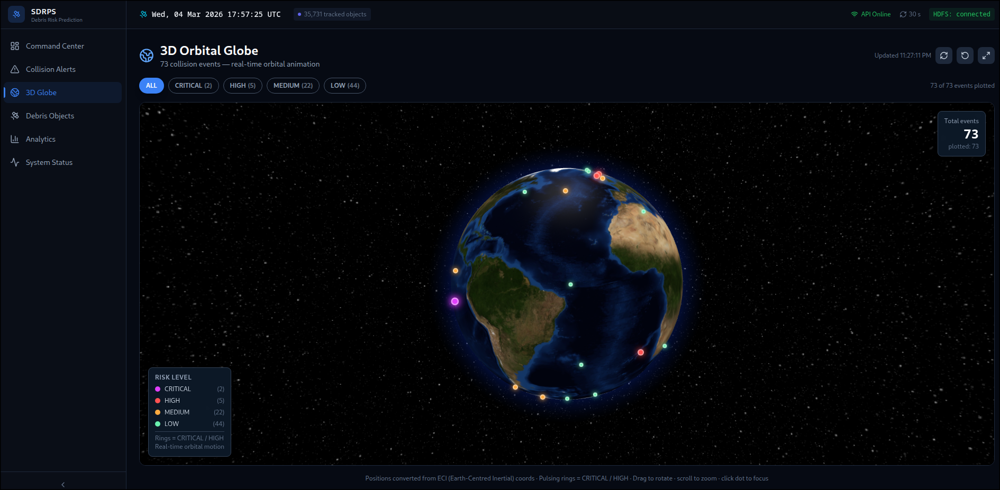

<div align="center">

# Space Debris Risk Prediction System




[](https://www.python.org/)
[](https://www.scala-lang.org/)
[](https://spark.apache.org/)
[](https://kafka.apache.org/)
[](https://react.dev/)
[](https://www.docker.com/)
[](https://spark.apache.org/mllib/)
[](https://github.com/Git-Roshan09/Space-Debris-Risk-Prediction/tree/final)

A real-time orbital collision risk assessment system that ingests Two-Line Element data for 15,000+ tracked objects, propagates orbits using SGP4, classifies objects with trained MLlib models (Random Forest · K-Means · Linear Regression), scores every conjunction pair with Apache Spark, and streams risk alerts to an interactive 3D globe dashboard — all in under 20 seconds per run.

</div>

---

## Architecture

```
HDFS Archive (/space-debris/state-vectors-archive)
  710 Parquet files · 168M rows · real TLE data (2004–2025)
        │
        ▼
 live_ingest.py  [Python · sgp4]
  Step 1  — Load latest TLE per NORAD_ID from HDFS archive (dedup by EPOCH desc)
  Step 2  — SGP4 propagation → ECI (x,y,z) state vectors at T=now
  Step 2b — Random Forest (MLlib) → OBJECT_TYPE: SATELLITE / DEBRIS
        │
        ├──► Kafka topic: state-vectors-live
        └──► HDFS /space-debris/state-vectors/live_sv_*.parquet
                            │
                            ▼
         CollisionPrediction.scala  [Spark 3.5 · Scala 2.12]
          Step 1  — Read live_sv_*.parquet from HDFS
          Step 2  — Catalog join (object name, country enrichment)
          Step 3  — Deduplicate: latest position per NORAD_ID
          Step 4  — Tracking stop conditions (altitude bounds filter)
          Step 4b — K-Means (MLlib) → ORBIT_SHELL: LEO / MEO / GEO / HEO
          Step 4c — Linear Regression (MLlib) → PREDICTED_ALTITUDE_KM
                    + PREDICTED_SPEED_KMS + delta cross-check columns
          Step 5  — Altitude-bucketed proximity detection
                    (SAT-SAT + SAT-DEB · threshold = 50 km)
          Step 6  — Risk: CRITICAL / HIGH / MEDIUM / LOW
                    + inverse-distance collision probability
          Step 7  — Write to HDFS + publish Kafka alerts
                            │
              ┌─────────────┴──────────────┐
              ▼                            ▼
   HDFS /collision-predictions/     Kafka topic:
   batch_YYYYMMDD_HHMMSS/           space_debris_collisions
   high_risk_batch_*/
   pipeline_metrics
                                          │
                                          ▼
                               dashboard_api.py  [Flask · port 5050]
                                          │
                                          ▼
                               React Dashboard  [globe.gl · port 3000]
                               3D orbital globe · risk-coloured dots
```

---

## Tech Stack

| Layer | Technology | Version | Role |
|---|---|---|---|
| Collision engine | Apache Spark | 3.5.0 | Distributed processing |
| Collision engine | Scala | 2.12.18 | Typed pipeline logic |
| ML models | Spark MLlib | 3.5.0 | RF · K-Means · Linear Regression |
| Orbital mechanics | Orekit + Hipparchus | 12.0 / 3.0 | Accurate force models |
| Orbit propagation | Python + sgp4 | 3.x | TLE → ECI state vectors |
| Message bus | Confluent Kafka (KRaft) | CP-Server 8.1.0 | Real-time alert streaming |
| Stream SQL | ksqlDB | 8.1.0 | Continuous queries on alert stream |
| Storage | Apache HDFS | 3.2.1 | Distributed Parquet store |
| SQL on HDFS | Apache Hive | 4.0.0 | Historical SQL queries |
| Cache | Redis | 7.2 | API response caching |
| API server | Flask + CORS | — | REST API, port 5050 |
| Dashboard | React + TypeScript + globe.gl | Vite build | 3D orbital globe |
| Infrastructure | Docker Compose | — | Service orchestration |

---

## ML Models

All models are trained once via `sbt "runMain MLlibTraining"` and saved to HDFS. They are loaded automatically on every pipeline run — no retraining needed.

| Model | Algorithm | HDFS Path | What It Does |
|---|---|---|---|
| Debris Classifier | Random Forest (20 trees) | `models/debris-classifier` | Classifies each propagated object as SATELLITE or DEBRIS using orbital features derived from ECI vectors (period, inclination, altitude) |
| Label Indexer | StringIndexer | `models/classifier-label-indexer` | Maps RF prediction index back to SATELLITE / DEBRIS string label |
| Orbit Shell Tagger | K-Means (K=4) | `models/orbit-clustering` | Tags every active object LEO / MEO / GEO / HEO; column travels into collision output and Kafka alerts |
| Altitude Predictor | Linear Regression | `models/trajectory-altitude` | Predicts altitude from position + velocity; large delta (actual − predicted) flags a stale TLE |
| Speed Predictor | Linear Regression | `models/trajectory-speed` | Predicts orbital speed from ECI position; large delta flags a manoeuvring object |

---

## Prerequisites

- Docker + Docker Compose
- Java 11+ (for sbt / Spark)
- sbt 1.x
- Python 3.9+
- Node.js 18+ (dashboard build only)

Python dependencies:

```
pip install sgp4 pandas pyarrow kafka-python requests flask flask-cors pyspark
```

---

## Quick Start

### 1. Start infrastructure

```bash
docker compose up -d
```

Wait ~30 seconds for HDFS, Kafka, and Redis to initialise.

### 2. Verify services are healthy

```bash
docker compose ps
curl -s http://localhost:9870/jmx?qry=Hadoop:service=NameNode,name=NameNodeStatus | grep -i state
```

### 3. (First time only) Train ML models

```bash
sbt "runMain MLlibTraining"
# Trains RF, K-Means, and Linear Regression models
# Saves all models + metrics to HDFS /space-debris/models/
```

### 4. Run the full pipeline once

```bash
./run_pipeline.sh once
```

### 5. Start the background scheduler

```bash
# Default interval: 30 minutes
./run_pipeline.sh start

# Custom interval (minutes)
./run_pipeline.sh start 15
```

### 6. Start the dashboard API

```bash
python3 dashboard_api.py
```

### 7. Serve the dashboard

```bash
cd dashboard && npx serve dist -l 3000
```

Open `http://localhost:3000` in your browser.

---

## Service Ports

| Service | Port | Notes |
|---|---|---|
| HDFS NameNode WebUI | 9870 | WebHDFS + file browser |
| HDFS RPC | 9000 | Spark / Python client endpoint |
| HDFS DataNode | 9864 | — |
| Kafka broker | 19092 | External listener |
| Schema Registry | 8081 | Avro schema management |
| Kafka Connect | 8083 | — |
| ksqlDB | 18088 | Stream SQL queries |
| Confluent Control Center | 9021 | Kafka management UI |
| Hive Metastore | 9083 | Thrift |
| HiveServer2 | 10000 | JDBC |
| Redis | 6379 | — |
| Redis Insight | 5540 | Redis GUI |
| Dashboard API | 5050 | Flask REST API |
| Dashboard | 3000 | React frontend |

---

## Project Structure

```
Space-Debris-Risk-Prediction/
├── live_ingest.py              # SGP4 ingestion: HDFS archive → Kafka + HDFS
├── pipeline_scheduler.py       # Task scheduler (Airflow replacement)
├── run_pipeline.sh             # Shell wrapper: start / stop / status / logs
├── dashboard_api.py            # Flask REST API (port 5050)
├── build.sbt                   # Scala/Spark project definition
├── docker-compose.yml          # Full infrastructure stack
├── Dockerfile
├── .env                        # Space-Track credentials (not committed)
│
├── src/main/scala/
│   ├── CollisionPrediction.scala       # Primary Spark pipeline (runMain target)
│   ├── CollisionDetector.scala
│   ├── MLlibTraining.scala
│   ├── TLEStreamProcessor.scala
│   ├── TLEBatchProcessor.scala
│   ├── TLEProcessor.scala
│   └── StreamingCollisionDetector.scala
│
├── dashboard/
│   ├── src/pages/GlobePage.tsx         # 3D globe visualisation
│   └── dist/                           # Production build (npm run build)
│
├── data/raw/                           # Historical TLE text files (2004–2025)
├── orekit-data/                        # Orbital mechanics data (EOP, ephemerides)
├── Output/
│   ├── space_debris_catalog.csv
│   └── TLE_Processed/
│
├── scripts/
│   ├── data_fetch/                     # One-time Space-Track data fetchers
│   └── utils/                          # HDFS inspection, data generation tools
│
└── archive/
    ├── old_pipeline/                   # 17 superseded scripts (reference only)
    └── old_scala/                      # Early Scala prototypes
```

---

## Pipeline Details

### Scheduler (`pipeline_scheduler.py`)

Three tasks run sequentially on a configurable interval:

1. **Health check** — verifies HDFS NameNode and Kafka broker are reachable before proceeding
2. **Live ingest** (`live_ingest.py`) — reads latest TLE per NORAD_ID from HDFS archive, propagates with SGP4, runs Random Forest classifier for SATELLITE/DEBRIS labels, writes ECI state vectors to HDFS
3. **Collision detection** (`sbt "runMain CollisionPrediction"`) — Spark job reads freshly written parquet, runs K-Means orbit tagging + LR cross-check, detects conjunction pairs, classifies risk, emits alerts

### `run_pipeline.sh` Commands

```bash
./run_pipeline.sh start [interval_minutes]   # start background scheduler
./run_pipeline.sh stop                        # stop background scheduler
./run_pipeline.sh restart [interval_minutes] # restart with optional new interval
./run_pipeline.sh status                      # show PID and running state
./run_pipeline.sh once                        # single pipeline run, then exit
./run_pipeline.sh logs                        # tail scheduler.log
```

---

## Collision Risk Thresholds

| Level | Miss Distance |
|---|---|
| CRITICAL | ≤ 1.0 km |
| HIGH | ≤ 20.0 km |
| MEDIUM | ≤ 35.0 km |
| LOW | ≤ 50.0 km |

Conjunction pairs are evaluated for **SAT-SAT** and **SAT-DEB** geometries. DEB-DEB pairs are excluded to limit combinatorial explosion at scale.

---

## Running Individual Components

### Ingestion only

```bash
python3 live_ingest.py \
    --n-sat 5000 \
    --n-deb 10000 \
    --sample-file 2 \
    --no-kafka
```

| Flag | Default | Description |
|---|---|---|
| `--n-sat N` | 5000 | Number of satellite TLEs to propagate |
| `--n-deb N` | 10000 | Number of debris TLEs to propagate |
| `--sample-file N` | 0 (all) | Number of HDFS archive files to sample from |
| `--no-kafka` | false | Skip Kafka write, output to HDFS only |
| `--no-rf` | false | Skip RF classifier, use NORAD heuristic fallback |

### ML training (one-time)

```bash
sbt "runMain MLlibTraining"
```

Trains Random Forest, K-Means, and Linear Regression models on the HDFS state vector and catalog data. Saves all models to `hdfs://localhost:9000/space-debris/models/` and metrics to `/space-debris/ml-results/`.

### Collision detection (Spark + ML inference)

```bash
sbt "runMain CollisionPrediction"
```

Reads `hdfs://localhost:9000/space-debris/state-vectors/live_sv_*.parquet`, applies K-Means orbit tagging and LR altitude/speed cross-check, detects conjunction pairs, writes results to `/space-debris/collision-predictions/batch_YYYYMMDD_HHMMSS/`.

### Dashboard API

```bash
python3 dashboard_api.py
# Endpoints: /api/health  /api/stats  /api/collisions  /api/collisions/globe
#            /api/collisions/high-risk  /api/ml/metrics  /api/pipeline/status
```

### Dashboard (development)

```bash
cd dashboard
npm install
npm run dev        # Vite dev server
# or
npm run build && npx serve dist -l 3000   # production
```

---

## HDFS Data Layout

| Path | Contents |
|---|---|
| `/space-debris/state-vectors-archive/` | 710 parquet files · 168M rows · historical TLE + ECI |
| `/space-debris/state-vectors/` | `live_sv_*.parquet` — current pipeline run output |
| `/space-debris/collision-predictions/batch_*/` | Full collision results per run |
| `/space-debris/collision-predictions/high_risk_batch_*/` | CRITICAL + HIGH subset only |
| `/space-debris/collision-predictions/pipeline_metrics` | Run duration, object counts (append-only) |
| `/space-debris/stopped-tracking/` | Objects outside valid altitude range per batch |
| `/space-debris/catalog` | Space debris object catalog (names, countries) |
| `/space-debris/models/debris-classifier` | Random Forest model (SATELLITE/DEBRIS) |
| `/space-debris/models/classifier-label-indexer` | StringIndexer for RF labels |
| `/space-debris/models/orbit-clustering` | K-Means model (orbit shell) |
| `/space-debris/models/trajectory-altitude` | Linear Regression (altitude predictor) |
| `/space-debris/models/trajectory-speed` | Linear Regression (speed predictor) |
| `/space-debris/ml-results/clustered-debris` | Catalog rows with K-Means cluster IDs |
| `/space-debris/ml-results/metrics` | RF accuracy, LR RMSE/R² scores (JSON) |

---

## Configuration

Create a `.env` file in the project root with Space-Track credentials if fetching fresh TLE data:

```env
SPACETRACK_USER=your_email@example.com
SPACETRACK_PASS=your_password
```

The ingestion pipeline (`live_ingest.py`) reads from the local HDFS archive by default and does not require Space-Track access during normal operation.

---

## Sample Output

Latest pipeline run (single execution, `--run-once`):

```
Objects analysed     : 15,755  (5,501 satellites + 10,254 debris)
RF classifications   : 15,755  (OBJECT_TYPE assigned via Random Forest)
Orbit shells tagged  : LEO=11,204 · MEO=1,023 · HEO=892 · GEO=2,636  (K-Means)
Conjunction pairs    : 73       (6 SAT-SAT + 67 SAT-DEB)
HIGH risk alerts     : 7
Execution time       : 18.7 s
```

**Collision record columns (key fields):**

| Column | Source | Description |
|---|---|---|
| `SAT_1`, `SAT_2` | Catalog | NORAD IDs of the pair |
| `OBJECT_TYPE_1/2` | RF Model | SATELLITE or DEBRIS |
| `ORBIT_SHELL` | K-Means | LEO / MEO / GEO / HEO |
| `ORBIT_CLUSTER` | K-Means | Raw cluster index (0-3) |
| `DISTANCE_KM` | Geometry | Euclidean separation |
| `RISK_LEVEL` | Threshold | CRITICAL / HIGH / MEDIUM / LOW |
| `PREDICTED_ALTITUDE_KM` | LR Altitude | ML-predicted altitude |
| `ALTITUDE_DELTA_KM` | LR Altitude | Observed − predicted (stale TLE indicator) |
| `PREDICTED_SPEED_KMS` | LR Speed | ML-predicted speed |
| `SPEED_DELTA_KMS` | LR Speed | Observed − predicted (manoeuvre indicator) |

---

## Acknowledgements

- [Orekit](https://www.orekit.org/) — open-source space dynamics library
- [sgp4](https://pypi.org/project/sgp4/) — Python SGP4/SDP4 propagator
- [Space-Track.org](https://www.space-track.org/) — TLE data source
- [globe.gl](https://globe.gl/) — WebGL globe visualisation
- [Confluent Platform](https://www.confluent.io/) — Kafka distribution
- [Apache Spark MLlib](https://spark.apache.org/mllib/) — distributed machine learning (RF, K-Means, LR)
